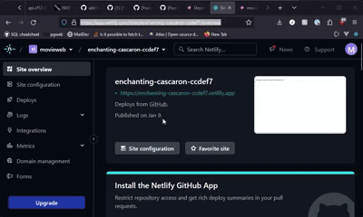

import { Steps } from '@astrojs/starlight/components';

This page explains all the different ways you can enable Zog to stream your favorite movies & TV shows, each with their own pros and cons.

## Method 1 - Self-hosted proxy

Self-hosting a proxy is an easy way to get faster streaming speeds, [we have a guide](/proxy/deploy) that explains how to set up one for **free**.

This method is recommended if you want to host a proxy for your friends and or family to use, as it is the faster than using the public proxy and the most reliable way to stream media at the moment.

<Steps>
1. Set up a proxy using one of our [guides](/proxy/deploy), [though we recommend Docker](/proxy/deploy#method-1-docker-recommended).

2. Once that's done, go to the **Connections** section of the **Settings page**
   on your Zog instance of choice.

3. Enable `Use custom proxy workers` if it's not already enabled.

4. Add a new custom proxy by clicking `Add new worker`.

5. Copy the URL of the proxy you deployed before, and paste it into the empty text box.
   
</Steps>

:::note
If you're self-hosting the client, you can use the
[`VITE_CORS_PROXY_URL`](/client/configuration#vite-cors-proxy-url)
variable to set the proxy URL for everyone who uses your client.
:::

## Method 2 - Public proxy

The public proxy is the easiest way to get started with Zog as it is the default, it is hosted by us and is completely free to use.

If you are using the main website, then you are most likely already using the public proxy. Unfortunately you will most likely be getting slower speeds and your video might be buffering more often, which is why we recommend using a self-hosted proxy if you can.

This is not the case with self-hosted clients, there is no proxy set up by default on self-hosted clients and you will need to [set up one yourself](/proxy/deploy).
